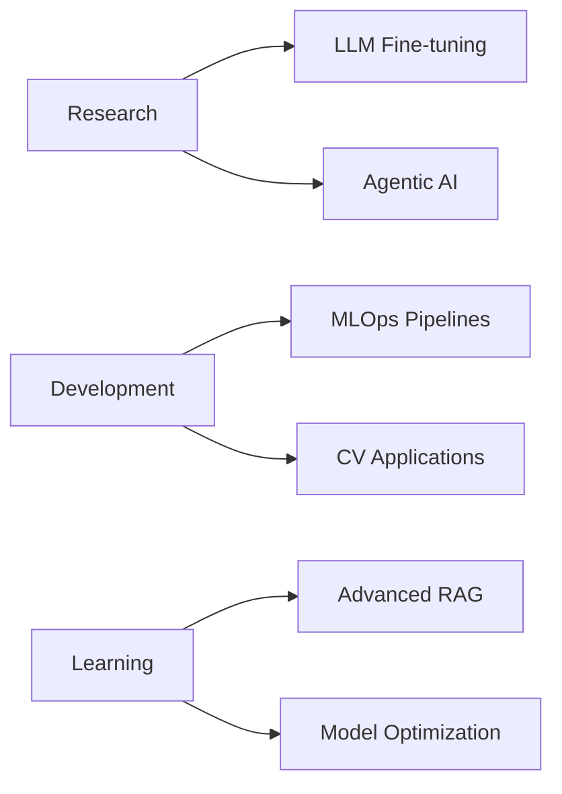

Readme · MD
Copy

# Sujal Khant

<div align="center">
  
### AI Engineer | Machine Learning Specialist | Deep Learning Researcher

<p align="center">
  <em>Transforming complex data into intelligent solutions through advanced machine learning and deep learning systems</em>
</p>

[](https://www.linkedin.com/in/sujal-khant-234931356)
[](mailto:sujalkhant4@gmail.com)
[](https://github.com/Sujal1035-tech)

</div>

---

## 🎓 Professional Summary

Experienced AI Engineer specializing in the design, development, and deployment of production-grade machine learning systems. With expertise spanning deep learning, computer vision, and generative AI, I focus on creating scalable, efficient solutions that bridge the gap between cutting-edge research and real-world applications.

**Core Competencies:**
- End-to-end ML pipeline development and optimization
- Deep learning architecture design and implementation
- Computer vision and image processing systems
- Large Language Models and Generative AI applications
- MLOps and model deployment strategies

---

## 🛠 Technical Stack

### **Programming & Core Technologies**
```
Python  •  JavaScript  •  Java  •  SQL  •  Bash/Shell
```

### **Machine Learning & Deep Learning**
```
PyTorch          TensorFlow        Keras             Scikit-learn
XGBoost          LightGBM          CatBoost          ONNX
```

### **AI & Generative Models**
```
Hugging Face     LangChain         OpenAI API        Anthropic Claude
LlamaIndex       RAG Systems       Vector Databases  Fine-tuning
```

### **Computer Vision**
```
OpenCV           YOLO              Detectron2        Albumentations
Pillow           Torchvision       Image Segmentation Object Detection
```

### **MLOps & Deployment**
```
Docker           Kubernetes        MLflow            DVC
FastAPI          Flask             Streamlit         Gradio
AWS              Git/GitHub        CI/CD             Model Serving
```

### **Data Engineering**
```
Pandas           NumPy             Polars            Apache Spark
MongoDB          PostgreSQL        Redis             Pinecone
```

---

## 💡 Areas of Expertise

<table>
<tr>
<td width="50%">

### 🤖 Machine Learning
- Supervised & Unsupervised Learning
- Time Series Forecasting
- Ensemble Methods
- Model Optimization & Hyperparameter Tuning
- Feature Engineering & Selection

</td>
<td width="50%">

### 🧠 Deep Learning
- Neural Network Architectures (CNN, RNN, LSTM, Transformers)
- Transfer Learning & Fine-tuning
- Model Compression & Quantization
- Custom Layer Development
- Training Optimization Techniques

</td>
</tr>
<tr>
<td width="50%">

### 👁 Computer Vision
- Image Classification & Object Detection
- Image Segmentation & Instance Segmentation
- Facial Recognition Systems
- OCR & Document Processing
- Video Analytics

</td>
<td width="50%">

### 🚀 Generative AI
- Large Language Model Integration
- Prompt Engineering & Optimization
- Retrieval-Augmented Generation (RAG)
- Agentic AI Systems
- Custom Chatbot Development

</td>
</tr>
</table>

---

## 📊 Current Focus



**Active Projects & Research:**
- Developing autonomous AI agents with multi-step reasoning capabilities
- Implementing advanced RAG architectures for domain-specific applications
- Optimizing large language models for production deployment
- Building scalable computer vision systems for real-time processing

---

## 🎯 Professional Philosophy

> *"The true measure of an AI system isn't just its accuracy on benchmarks, but its ability to create meaningful impact in production environments. I believe in building solutions that are not only technically sophisticated but also practical, scalable, and maintainable."*

---

## 📈 GitHub Analytics

<div align="center">
  


</div>

---

## 🤝 Let's Collaborate

I'm always interested in discussing innovative AI projects, research collaborations, and opportunities to solve challenging problems. Whether you're working on cutting-edge ML research or building production AI systems, I'd love to connect.

**Open to:**
- Technical Consulting & Advisory
- Research Collaborations
- Open Source Contributions
- Speaking & Workshop Opportunities

<div align="center">

### 📫 Get In Touch

[](https://www.linkedin.com/in/sujal-khant-234931356)
[](mailto:sujalkhant4@gmail.com)
[](https://github.com/Sujal1035-tech)

</div>
